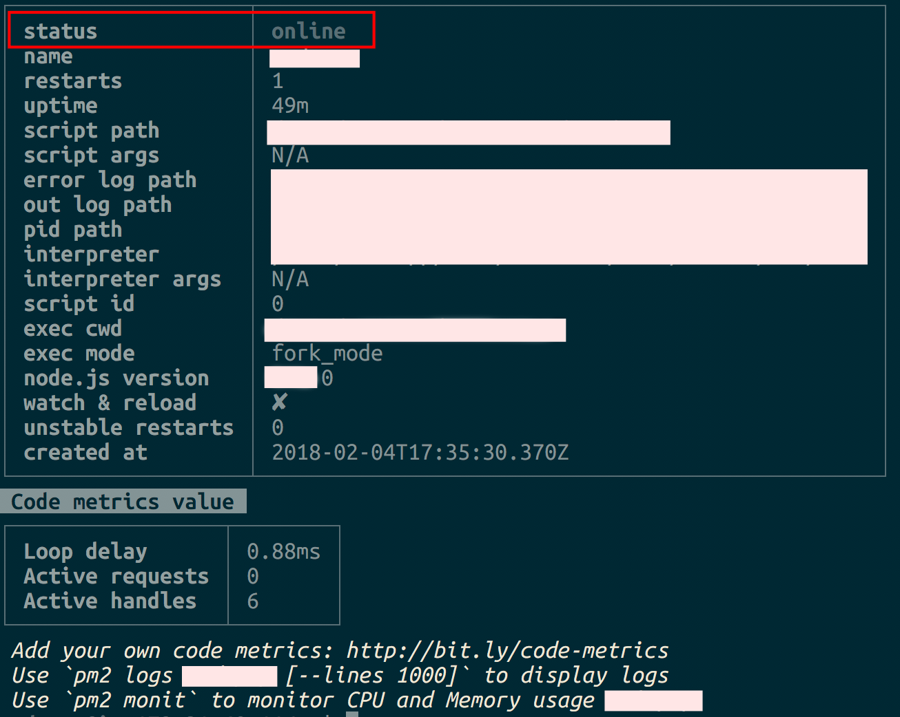
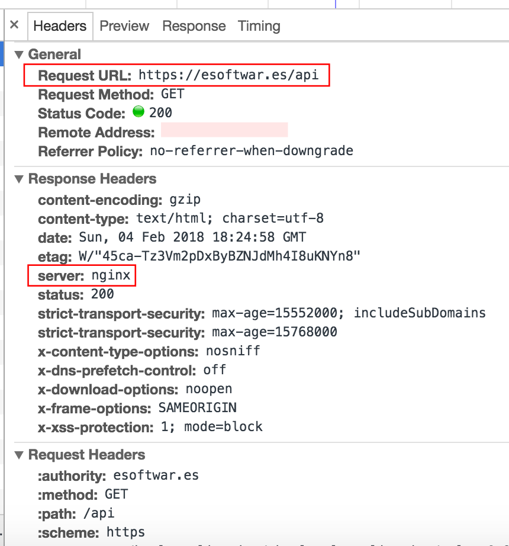
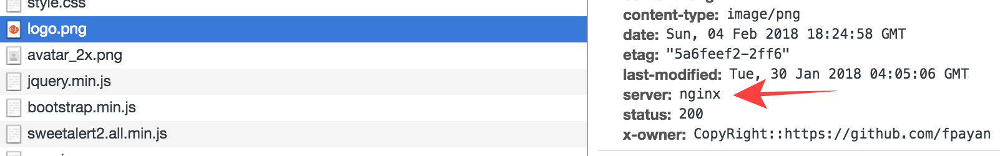
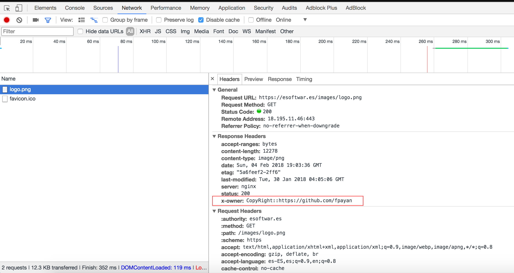
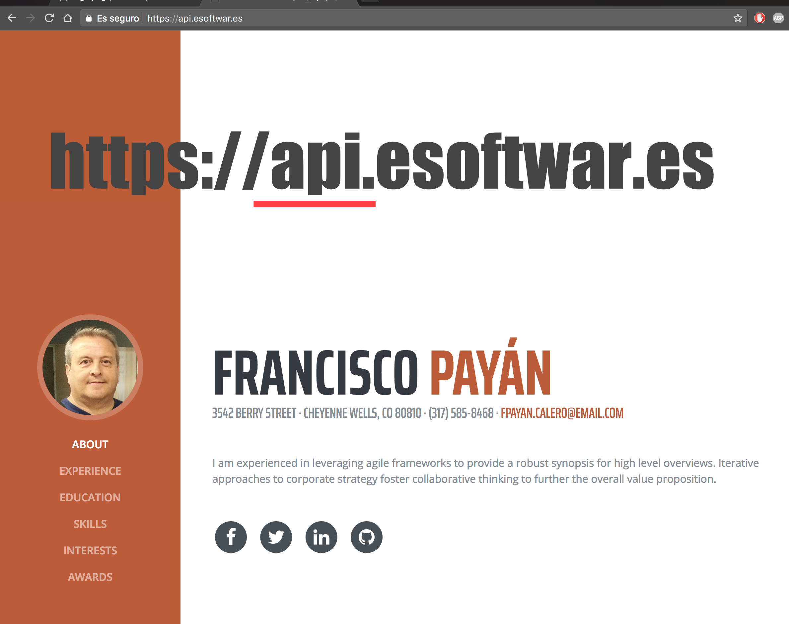

# Node API v1.0.0

---

### Práctica para el módulo **DevOps** del VI Bootcamp Mobile [keepcoding.io](https://keepcoding.io/es/)

___

### Ejercicio 1

Cada alumno deberá desplegar en un servidor su desarrollo para la práctica del curso de Programación Backend con Node.

#### Acciones:
1. Indicar la URL donde está desplegada la práctica para que pueda ser evaluada
2. Utilizar node como servidor de aplicación utilizando PM2 como gestor de procesos node para que siempre esté en ejecución.
3. Utilizar nginx como proxy inverso que se encargue de recibir las peticiones HTTP y derivárselas a node.
4. Los archivos estáticos de la aplicación *(imágenes, css, etc.)* deberán ser servidos por nginx (no por node).
5. Para poder diferenciar quién sirve estos estáticos, se deberá añadir una cabecera HTTP cuando se sirvan estáticos cuyo valor sea: X-Owner (la X- indica que es una cabecera personalizada) y el valor de la cabecera deberá ser el nombre de la cuenta de usuario en github o bitbucket del alumno.

##### Acción 1:

Url de despliegue [Acceder a la interface de la api](https://esoftwar.es/api) **https://esoftwar.es/api**

##### Acción 2:

PM2 en el servidor:  Ir a [PM2](http://pm2.keymetrics.io/)

##### Acción 3:

Utilizar nginx como proxy inverso:

##### Acción 4:

Archivos estáticos servidos por nginx con cabecera **X-Owner** y valor url repo *GitHub*

##### Acción 5:

Cabezera de archivos estáticos con valor **X-Owner**

Ver página de archivo estático [logo](https://esoftwar.es/images/logo.png)

### Ejercicio 2

Si se accede al servidor web indicando la dirección de un subdominio, se deberá mostrar el contenido de alguna plantilla de [https://startbootstrap.com](https://startbootstrap.com).

Dirección del subdominio [Ir al subdominio](https://api.esoftwar.es/)

by [esoftwar.es](https://esoftwar.es) CopyRight 2018.

